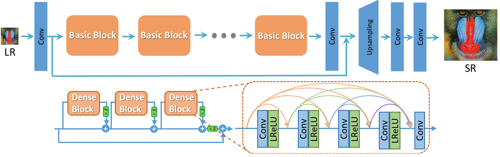
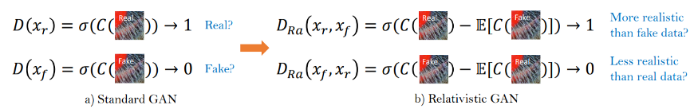
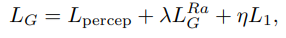
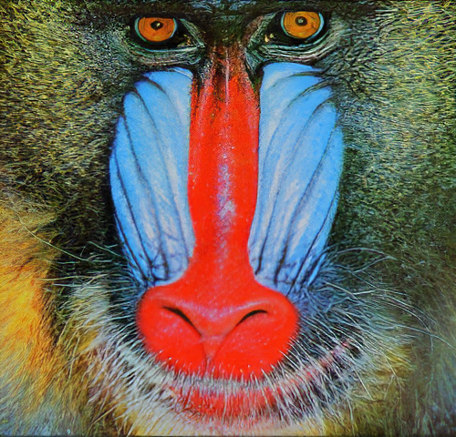
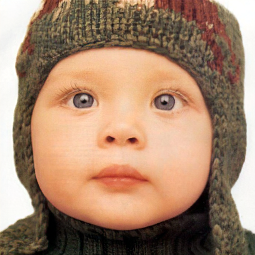
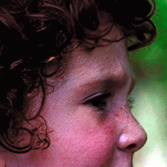
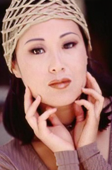

# Enhanced Super-Resolution Using a Generative Adversarial Network

The Super-Resolution Generative Adversarial Network (SRGAN) is a seminal work that is capable of generating realistic textures during single image super-resolution. However, the hallucinated details are often accompanied with unpleasant artifacts. To further enhance the visual quality, This paper thoroughly study three key components of SRGAN - network architecture, adversarial loss and perceptual loss, and improve each of them to derive an Enhanced SRGAN (ESRGAN). In particular, Author of this paper introduce the Residual-in-Residual Dense Block (RRDB) without batch normalization as the basic network building unit. Moreover, the idea from relativistic GAN to let the discriminator predict relative realness instead of the absolute value. Finally, improved the perceptual loss by using the features before activation, which could provide stronger supervision for brightness consistency and texture recovery. Benefiting from these improvements, the proposed ESRGAN achieves consistently better visual quality with more realistic and natural textures than SRGAN and won the first place in the PIRM2018-SR Challenge.

# Model Architecture



ESRGAN follows the baseline ResNet-style architecture of SRGAN but replaces the residual block with the RRDB block. The RRDB block is inspired by the DenseNet architecture and connects all layers within the residual block directly with each other. We can implement the RRDB block similar to DenseNet by feeding the concatenated array of the output of every previous layer to the next convolution.
The ESRGAN generator model is exactly same with the SRGAN generator except for the modification to the residual block. Therefore, we can simply freeze the SRGAN model implementation and only change the residual block.

The authors quote “Removing BN layers has proven to increase performance and reduce the computational complexity in different PSNR-oriented tasks including SR and deblurring.”, and therefore remove the batch normalization layer in every residual block. This is because the statistics of each layer are very very different for every image and also for test images. This is against the assumption of BN that the features for train/test images are similar and thus uses the statistics of training data for the test set.

Besides, the authors experiment with several techniques to improve the performance and adopt residual scaling and smaller initialization of parameters. Residual scaling is multiplying the residual scaling is the process of multiplying a parameter β from the range [0, 1] to the output of the residual before adding to the main block. β=0.2 is used in this paper.


# Improvement in Loss Function



Relativistic loss measures the “relative” reality between images by modifying the discriminator to predict the probability of Xr is more realistic than Xf. The authors argue that this modification of the role of the discriminator to have “shown to benefit learning sharper edges and more detailed textures”.

# Modified VGG loss

The authors argue that signals mostly die after the activation function. For example, the average percentage of activated neurons for image ‘baboon’ after the VGG19–54 layer is merely 11.17%. Therefore, the authors compare the features before the ReLU activation for measuring the VGG loss. Since the ReLU activation function was embedded inside the Conv layer, this modified VGG loss is implemented by manually applying the convolution operation and adding the bias weight at the final layer.

# Complete loss

The total loss is defined as the three losses combined. The hyperparameters on each weight are set to λ = 5×10−3 and η = 1×10−2. This paper adds the L1 loss together with the VGG perceptual loss, which is different from SRGAN.




# Results

**Input Image**


**Super Resolution Image**



**Input Image**


**Super Resolution Image**



**Input Image**


**Super Resolution Image**


**Input Image**


**Super Resolution Image**


**Input Image**


**Super Resolution Image**



**Input Image**


**Super Resolution Image**



# Citation

```
@InProceedings{wang2018esrgan,
    author = {Wang, Xintao and Yu, Ke and Wu, Shixiang and Gu, Jinjin and Liu, Yihao and Dong, Chao and Qiao, Yu and Loy, Chen Change},
    title = {ESRGAN: Enhanced super-resolution generative adversarial networks},
    booktitle = {The European Conference on Computer Vision Workshops (ECCVW)},
    month = {September},
    year = {2018}
}

```